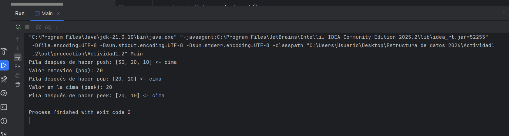

# Actividad 1.2 - Pila aplicada a Undo/Redo en Java

**Estudiante:** Steven Zuluaga Cortés
Julian David Niño Cuervo

## 1) Proposito de la actividad
Que el estudiante comprenda el concepto de **pila (Stack)** y su estructura LIFO (*Last In, First Out*), y que sea capaz de aplicarlo en un simulador de **deshacer/rehacer (Undo/Redo)** para un editor de texto simple en Java, trabajando en equipo y usando buenas practicas con GitHub.

## 2) Objetivos de aprendizaje
- Identificar las operaciones basicas de una pila: `push`, `pop`, `peek`, `isEmpty` y `size`.
- Relacionar la teoria de pilas con un caso real: historial de acciones en un editor de texto.
- Implementar y probar una pila en Java.
- Entender como modelar el flujo de `Undo` y `Redo` con **dos pilas**.
- Colaborar en equipo con control de versiones y flujo de trabajo en GitHub.

## 3) Estructura actual del proyecto
```text
Actividad1.2/
├── README.md
└── src/
    ├── Main.java
    └── Stack.java
```

### Descripcion de archivos
- `src/Stack.java`: implementa una pila dinamica basada en `ArrayList<Integer>`.
- `src/Main.java`: ejemplo de uso de la pila con operaciones `push`, `pop` y `peek`.

## 4) Concepto clave: Undo/Redo con pilas
En un editor de texto simple, se recomienda usar dos pilas:

- **undoStack**: guarda las acciones realizadas.
- **redoStack**: guarda las acciones deshechas para poder rehacerlas.

Flujo basico:
1. Cuando el usuario realiza una accion nueva, se hace `push` en `undoStack` y se limpia `redoStack`.
2. Al hacer **Undo**, se hace `pop` de `undoStack`, se revierte la accion y se hace `push` en `redoStack`.
3. Al hacer **Redo**, se hace `pop` de `redoStack`, se reaplica la accion y se hace `push` en `undoStack`.

Este patron permite modelar historial de cambios de forma clara, eficiente y escalable.

## 5) Como ejecutar el proyecto
Desde la raiz del proyecto:

```powershell
javac src\Main.java src\Stack.java
java -cp src Main
```

Salida esperada aproximada:
- Estado de la pila despues de varios `push`.
- Valor removido con `pop`.
- Valor observado en la cima con `peek`.

## 6) Trabajo en equipo y buenas practicas con GitHub
### Flujo recomendado
- Crear una rama por tarea: `feature/nombre-tarea`.
- Hacer commits pequenos y descriptivos.
- Abrir Pull Request para revision por otro integrante.
- Integrar cambios solo cuando la revision este aprobada.

### Convenciones sugeridas
- Mensajes de commit claros, por ejemplo:
  - `feat: implementar metodo push en Stack`
  - `fix: corregir validacion de pila vacia en pop`
  - `docs: actualizar README con flujo undo/redo`
- Mantener el codigo legible, con nombres claros y pruebas manuales minimas antes de subir cambios.

## 7) Criterios de logro
Se considera que la actividad cumple su objetivo cuando el equipo:
- Explica correctamente el comportamiento LIFO.
- Implementa y usa la pila en Java.
- Puede describir y/o implementar el flujo Undo/Redo con dos pilas.
- Evidencia colaboracion real mediante historial de commits, ramas y Pull Requests en GitHub.

## 8) Mejoras futuras
- Implementar una clase `Action` para representar cambios de texto.
- Crear una clase `TextEditor` con `write`, `undo` y `redo`.
- Agregar pruebas unitarias para validar escenarios limite (pilas vacias, multiples undos/redos, etc.).


